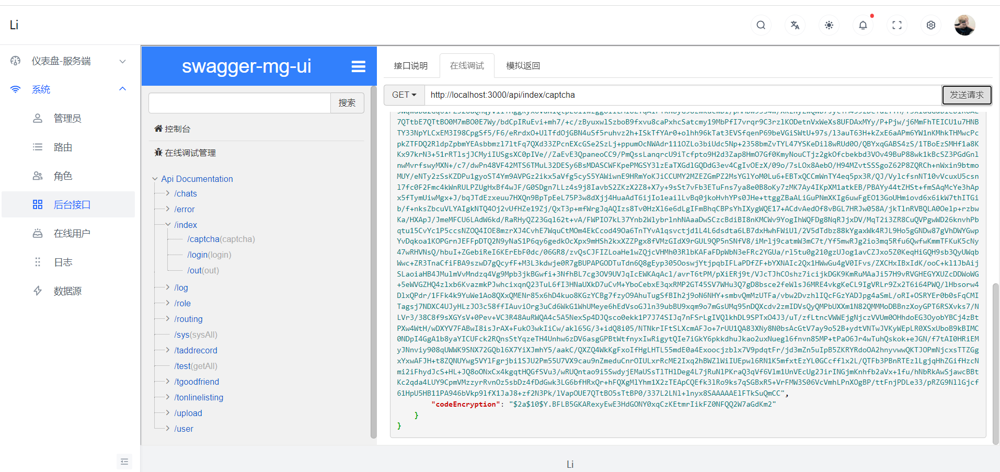
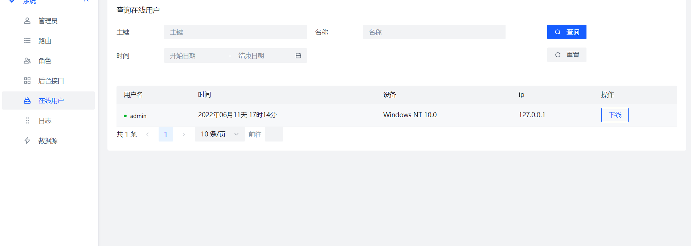

  <h1 align="center">QuickBuild</h1>
<p align="center">
 


<a src="https://blog.csdn.net/qq_37437493?spm=1003.2020.3001.5343">💟</a>
</p>
  
 ## 架构体系
 

 ## 模块说明 （超详细说明）
 ### lq-admin (核心模块)

```
    aop:日志
    config：
           corsConfig:跨越配置
           FileMaxConfig：文件上传大小配置
           GlobIException:全局异常配置
           Mylmage:文件映射配置
           RedisConfig:redis配置
           SatokenConfigure: sa-token权限认证配置
           StpInterfaceImpl：角色配置 需要的 小伙伴自行放开
           SwaggerConfig: 接口文档的配置
    exception:
           处理我们的sa-tokem的异常配置
    module:  模块
           lq:
              chatroom:
                       这个是利用neety写的聊天室接口（ 页面目前没有完善只有接口）
              sys： 系统利用到的接口
                  TchatStorageController: 
                                          聊天信息取口
                  TLogController:
                                 登录接口（验证码，登录，退出....）
                  TOnlineListingController：
                                           在线用户接口
                  TOssController:
                                  整合oss阿里对象储存：
                                                    请求流程: 
                                                             从后端拿到我们的上传凭证 返回给前端在去请求oss接口
                  TRoleController：
                                  角色接口
                  TRoutingController：
                                  路由接口
                  TChatStorageController：
                                        系统信息接口
                  TSysTestController：
                                     系统测试接口
                  TUserController：
                                  用户接口
                  UploadPictureController：
                                    文件上传接口
```

 ### lq-common (公共模块)
 ```
     config:
            FileConfig: 文件公共路径

     statuscode:
            TUserStatusCode：用户状态枚举
     
     utils: 
           Q: 返回实体类（熟悉的链式编程）
           ExcelUtils： 表格导出导入公共方法
           ImageUtil：图片上传
           OnlineTools: 获取ip
           PasswordEncryp： 密码加密和判断
           SysUtile ：系统信息获取
     
     xss:
           sql防止注入
```

 ### lq-constructor(代码生成器) 人人代码代码生成器 二开
```
     需要自定义代码生成器只需要在GenUtils的getFileName方法里面添加文件名
     写法按照其他模板的vm语法
``` 

 ### lq-mapper (dao层)
```
    config:
           Druid：数据源配置
           MyMetaObjectHandler：插入策略配置
    module：这里模板对应上面lq-admin的实体类
    utils：
           PageUtils：
                      分页创建
```
 ### lq-sql (数据库)

### lq-vue (前端)






##  快速入门
### 第一步 导入lq-sql 刷新数据库看到object就ok
### 第二步  配置一下lq-admin下的数据库信息
### 第三步启动 后台
### 第四步 解压lq-vue的压缩包
### 第五步 进入文件夹下输入命令
> npm run dev
> 访问http:localhost:3000


