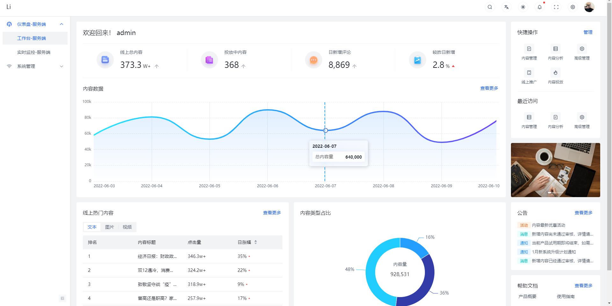
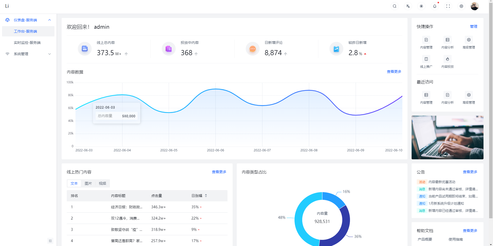
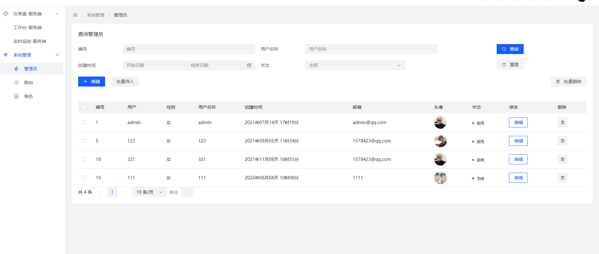
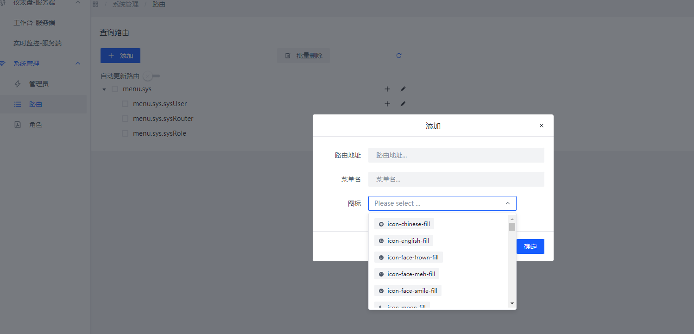
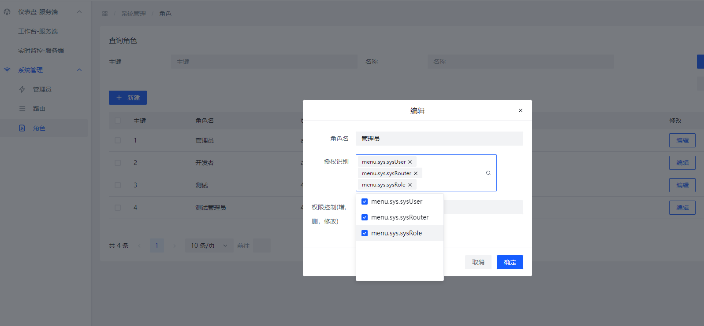

  <h1 align="center">快速搭建平台</h1>

 

<a src="https://blog.csdn.net/qq_37437493?spm=1003.2020.3001.5343">💟</a>

  
 ## 架构体系
 

 ## 模块说明
 ### lq-admin (核心模块)
    aop:日志
    config：配置
    exception：异常配置
    module：业务模块
    timer:定时器配置
    utils：工具类
 ### lq-common (公共模块)
     共用类或者是返回值

 ### lq-constructor(代码生成器) 人人代码代码生成器 二开
     需要自定义代码生成器只需要在GenUtils的getFileName方法里面添加文件名
     写法按照其他模板的vm语法

 ### lq-mapper (dao层)
     主要放置我们的sql语句编写
 ### lq-sql (数据库)

### lq-vue (前端)(功能还在扩展中ing，欢迎前端大佬加入)
 脚手架采用arco.design（字节跳动）提供的deom [arco.design](https://arco.design/vue/docs/start)
 直接上效果图

## 快速上手
###  > 第一步
导入模块lq-sql下的mysql文件
###  >第二步
修改我们的lq-admin下的配置信息 比如说mysql的链接信息
###  >第三步
解压我们lq-vue下的压缩包 解压过后
运行命令 npm run dev
### >访问地址http://localhost:3000/
 

